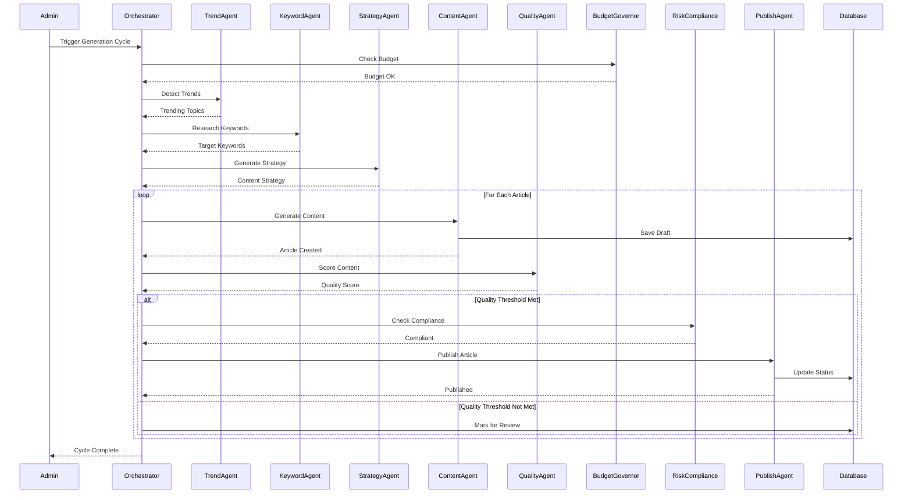
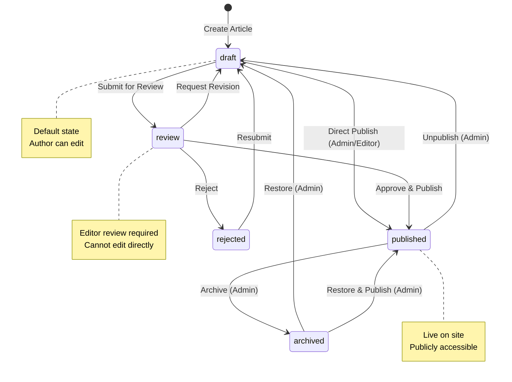
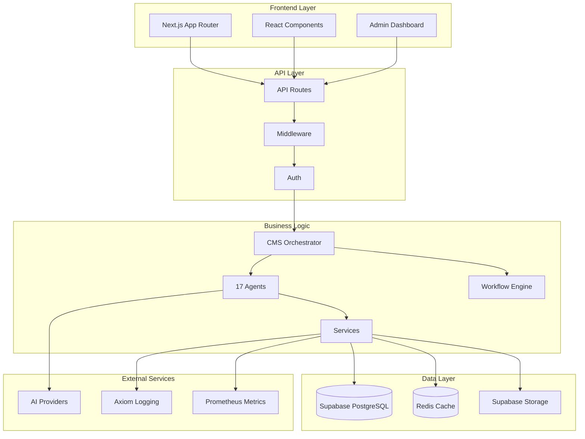
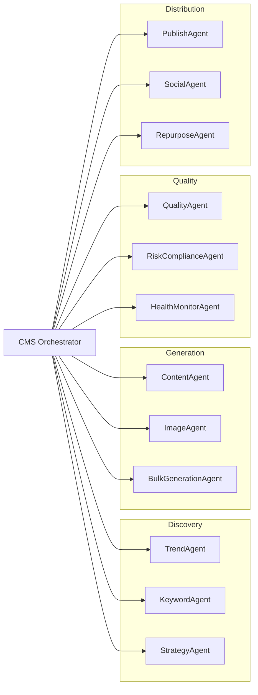
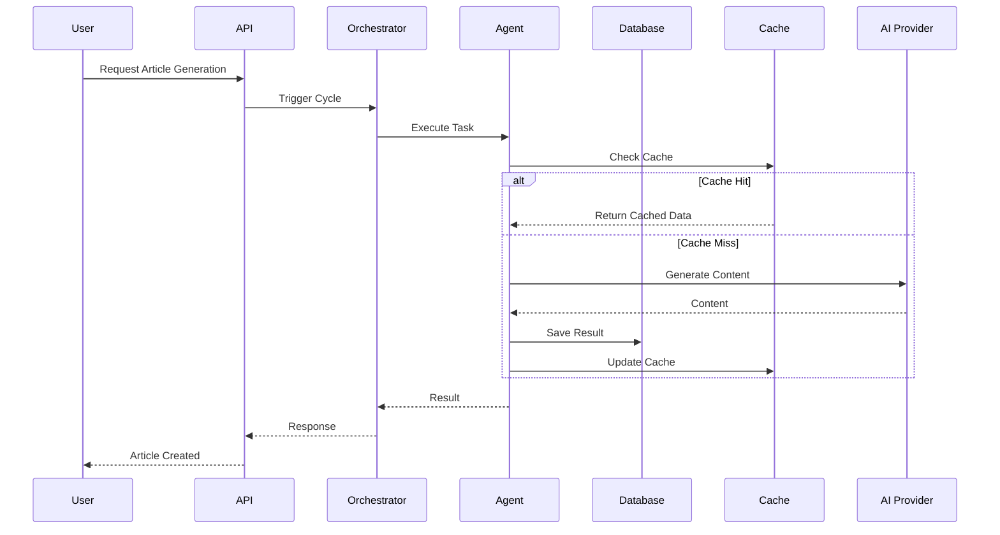

# System Design Documentation

**Version:** 1.0  
**Date:** January 22, 2026  
**Status:** Production  
**Platform:** InvestingPro.in - AI-Driven Financial Content Platform

---

## 📋 Table of Contents

1. [System Overview](#1-system-overview)
2. [End-to-End Content Generation Flow](#2-end-to-end-content-generation-flow)
3. [Agent Coordination Model](#3-agent-coordination-model)
4. [State Machine](#4-state-machine)
5. [Failure Modes & Recovery](#5-failure-modes--recovery)
6. [System SLA Targets](#6-system-sla-targets)
7. [Architecture Diagrams](#7-architecture-diagrams)
8. [API Contracts](#8-api-contracts)
9. [Database Schema](#9-database-schema)

---

## 1. System Overview

### 1.1 Platform Purpose

InvestingPro.in is an **automation-first content & product intelligence engine** designed to:
- Generate, score, publish, distribute, and continuously improve content
- Operate across multiple niche sites using a shared CMS "brain"
- Minimize human intervention
- Scale content, SEO, and monetization systematically

### 1.2 Core Principles

1. **Automation-First**: AI agents handle 95%+ of content lifecycle
2. **Quality Over Quantity**: Every article must meet quality thresholds
3. **Cost Discipline**: Budget governor prevents runaway costs
4. **Compliance First**: Risk compliance agent ensures regulatory safety
5. **Observability**: Comprehensive logging, tracing, and monitoring
6. **Fail-Safe**: Circuit breakers, retries, and graceful degradation

### 1.3 Technology Stack

**Frontend:**
- Next.js 14 (App Router)
- React 18
- TypeScript
- Tailwind CSS

**Backend:**
- Next.js API Routes (Serverless)
- Supabase (PostgreSQL + Auth + Storage)
- Redis (Upstash) - Caching & Distributed Locks

**AI & Automation:**
- Multi-provider AI (Gemini, GPT-4, Claude, Groq, Mistral)
- 17 specialized agents
- Workflow engine (declarative workflows)
- State machine enforcement

**Infrastructure:**
- Vercel (Deployment & Cron Jobs)
- Axiom (Logging & Tracing)
- Prometheus (Metrics)

---

## 2. End-to-End Content Generation Flow

### 2.1 High-Level Flow



### 2.2 Detailed Step-by-Step Process

#### Phase 1: Discovery & Strategy
1. **Trend Detection** (`TrendAgent`)
   - Scans financial news, social media, search trends
   - Identifies emerging topics
   - Output: List of trending topics with relevance scores

2. **Keyword Research** (`KeywordAgent`)
   - Analyzes search volume, competition, intent
   - Identifies target keywords
   - Output: Keyword list with priority scores

3. **Content Strategy** (`StrategyAgent`)
   - Determines article topics, angles, structure
   - Considers SEO, monetization, diversity
   - Output: Content strategy with article list

#### Phase 2: Content Generation
4. **Content Creation** (`ContentAgent`)
   - Uses AI to generate article content
   - Applies prompt templates (with A/B testing)
   - Includes SEO optimization
   - Output: Draft article with metadata

5. **Image Generation** (`ImageAgent`)
   - Generates or selects featured images
   - Optimizes for web performance
   - Output: Image URLs

#### Phase 3: Quality & Compliance
6. **Quality Scoring** (`QualityAgent`)
   - Scores readability, SEO, structure
   - Checks for plagiarism
   - Output: Quality score (0-100)

7. **Risk Compliance** (`RiskComplianceAgent`)
   - Validates financial advice compliance
   - Checks for forbidden phrases
   - Ensures regulatory safety
   - Output: Compliance status

#### Phase 4: Publishing & Distribution
8. **Publishing** (`PublishAgent`)
   - Updates article status to "published"
   - Generates sitemap entry
   - Triggers SEO indexing
   - Output: Published article

9. **Distribution** (`SocialAgent`, `RepurposeAgent`)
   - Creates social media posts
   - Repurposes content for different formats
   - Output: Distributed content

#### Phase 5: Monitoring & Optimization
10. **Tracking** (`TrackingAgent`)
    - Monitors article performance
    - Tracks views, engagement, conversions
    - Output: Performance metrics

11. **Feedback Loop** (`FeedbackLoopAgent`)
    - Analyzes performance data
    - Suggests improvements
    - Output: Optimization recommendations

---

## 3. Agent Coordination Model

### 3.1 Architecture Pattern

**Pattern:** Centralized Orchestrator with Specialized Agents

```
┌─────────────────────────────────────────┐
│         CMS Orchestrator                 │
│     (Central Coordinator)               │
└──────────────┬──────────────────────────┘
               │
    ┌──────────┴──────────┐
    │                     │
┌───▼────┐         ┌──────▼─────┐
│ Agents │         │  Services  │
│        │         │            │
│ 17     │         │ Database   │
│ Agents │         │ Cache      │
│        │         │ Queue      │
└────────┘         └────────────┘
```

### 3.2 Agent Types

#### Discovery Agents
- **TrendAgent**: Detects trending topics
- **KeywordAgent**: Researches keywords
- **StrategyAgent**: Generates content strategy

#### Generation Agents
- **ContentAgent**: Generates article content
- **ImageAgent**: Generates/selects images
- **BulkGenerationAgent**: Handles bulk operations

#### Quality Agents
- **QualityAgent**: Scores content quality
- **RiskComplianceAgent**: Ensures compliance
- **HealthMonitorAgent**: Monitors system health

#### Distribution Agents
- **PublishAgent**: Publishes articles
- **SocialAgent**: Creates social posts
- **RepurposeAgent**: Repurposes content

#### Optimization Agents
- **TrackingAgent**: Tracks performance
- **FeedbackLoopAgent**: Provides feedback
- **AffiliateAgent**: Manages affiliate links

#### Infrastructure Agents
- **BudgetGovernorAgent**: Manages costs
- **ScraperAgent**: Scrapes external data
- **EconomicIntelligenceAgent**: Economic analysis

### 3.3 Communication Model

**Current Model:** Synchronous Request-Response

- Orchestrator calls agents directly via method calls
- Agents return results synchronously
- Error handling via try-catch blocks
- Retry logic via `retry()` utility

**Future Model:** Event-Driven (Planned)

- Agents publish events to event bus
- Orchestrator subscribes to events
- Async processing with queues
- Better scalability and decoupling

### 3.4 Agent Lifecycle

1. **Initialization**: Agent instantiated by Orchestrator
2. **Execution**: Agent receives context, executes task
3. **Result**: Agent returns result or error
4. **Cleanup**: Agent state cleared (stateless design)

---

## 4. State Machine

### 4.1 Article Status States



### 4.2 Valid Transitions

| From State | To State | Allowed Roles | Notes |
|------------|----------|---------------|-------|
| draft | review | author, editor, admin | Submit for review |
| draft | published | editor, admin | Direct publish |
| review | draft | editor, admin | Request revision |
| review | published | editor, admin | Approve |
| review | rejected | editor, admin | Reject |
| rejected | draft | author, editor, admin | Resubmit |
| published | archived | admin | Archive |
| published | draft | admin | Unpublish |
| archived | draft | admin | Restore |
| archived | published | admin | Restore & publish |

### 4.3 State Machine Enforcement

**Database Level:**
- `validate_article_status_transition()` function
- `enforce_article_status_transition()` trigger
- CHECK constraint on status values

**Application Level:**
- Workflow engine validates transitions
- API endpoints check permissions
- Audit trail logs all transitions

---

## 5. Failure Modes & Recovery

### 5.1 Failure Categories

#### 1. Agent Failures
**Symptoms:**
- Agent throws exception
- Agent timeout
- Agent returns invalid result

**Recovery:**
- Retry with exponential backoff (3 attempts)
- Circuit breaker opens after threshold
- Fallback to alternative agent if available
- Log error and continue with next article

**Example:**
```typescript
try {
    const result = await retry(
        () => contentAgent.generate(article),
        { maxAttempts: 3, backoff: 'exponential' }
    );
} catch (error) {
    logger.error('ContentAgent failed', error);
    // Skip this article, continue with next
}
```

#### 2. Budget Exhaustion
**Symptoms:**
- Budget governor returns `canGenerate: false`
- Cost alerts triggered

**Recovery:**
- Auto-pause generation at 100% budget
- Alert administrators
- Wait for budget reset or manual intervention
- Resume when budget available

#### 3. Database Failures
**Symptoms:**
- Connection timeout
- Query failure
- Transaction rollback

**Recovery:**
- Retry with exponential backoff
- Use connection pool with retry logic
- Fallback to cached data if available
- Circuit breaker for database operations

#### 4. AI Provider Failures
**Symptoms:**
- API timeout
- Rate limit exceeded
- Provider unavailable

**Recovery:**
- Automatic failover to next provider
- Circuit breaker per provider
- Retry with backoff
- Fallback to cached responses

#### 5. Workflow Failures
**Symptoms:**
- Workflow step fails
- Circular dependency detected
- Invalid workflow definition

**Recovery:**
- Mark workflow as failed
- Log error details
- Allow manual retry
- Skip failed step if optional

### 5.2 Recovery Strategies

#### Retry Strategy
- **Exponential Backoff**: 1s, 2s, 4s, 8s
- **Max Attempts**: 3 (configurable)
- **Jitter**: Random delay to prevent thundering herd

#### Circuit Breaker
- **Failure Threshold**: 5 failures in 60s
- **Open Duration**: 60s
- **Half-Open**: Test after open duration

#### Graceful Degradation
- **Partial Results**: Return partial data if possible
- **Cached Data**: Use stale cache if fresh data unavailable
- **Default Values**: Use safe defaults

#### Timeout Protection
- **Default Timeout**: 30s per operation
- **Configurable**: Per-agent timeouts
- **Cancellation**: Cancel long-running operations

---

## 6. System SLA Targets

### 6.1 Availability

| Service | Target | Measurement |
|---------|--------|-------------|
| API Endpoints | 99.9% | Uptime percentage |
| Content Generation | 99.5% | Successful generations |
| Database | 99.95% | Connection availability |

### 6.2 Latency

| Operation | P50 | P95 | P99 |
|-----------|-----|-----|-----|
| API Request | <200ms | <500ms | <1s |
| Article Generation | <30s | <60s | <120s |
| Database Query | <50ms | <200ms | <500ms |
| AI Provider Call | <5s | <15s | <30s |

### 6.3 Throughput

| Operation | Target | Notes |
|-----------|--------|-------|
| Articles/Day | 50-100 | Depends on budget |
| API Requests/sec | 100 | Per instance |
| Database Queries/sec | 1000 | With connection pooling |

### 6.4 Error Rates

| Metric | Target | Measurement |
|--------|--------|-------------|
| API Error Rate | <1% | Errors / Total Requests |
| Content Generation Failure | <5% | Failed / Total Attempts |
| Database Error Rate | <0.1% | Errors / Total Queries |

### 6.5 Quality Metrics

| Metric | Target | Measurement |
|--------|--------|-------------|
| Content Quality Score | >80 | Average quality score |
| SEO Score | >85 | Average SEO score |
| Compliance Rate | 100% | Compliant / Total |

---

## 7. Architecture Diagrams

### 7.1 System Architecture



### 7.2 Agent Coordination



### 7.3 Data Flow



---

## 8. API Contracts

### 8.1 Article Generation API

**Endpoint:** `POST /api/v1/articles/generate`

**Request:**
```typescript
{
    topic: string;
    category: string;
    keywords?: string[];
    language?: string;
    tone?: string;
}
```

**Response:**
```typescript
{
    success: boolean;
    articleId?: string;
    jobId?: string;
    error?: {
        code: string;
        message: string;
    };
}
```

### 8.2 Workflow Execution API

**Endpoint:** `POST /api/v1/workflows/execute`

**Request:**
```typescript
{
    workflowId: string;
    context?: Record<string, any>;
}
```

**Response:**
```typescript
{
    success: boolean;
    instanceId: string;
    state: 'pending' | 'running' | 'completed' | 'failed';
    error?: string;
}
```

### 8.3 Budget Check API

**Endpoint:** `GET /api/v1/budget/status`

**Response:**
```typescript
{
    success: boolean;
    data: {
        canGenerate: boolean;
        tokensRemaining: number;
        imagesRemaining: number;
        costRemaining: number;
        isPaused: boolean;
    };
}
```

---

## 9. Database Schema

### 9.1 Core Tables

#### articles
- Primary content storage
- Status: draft, review, published, archived, rejected
- SEO metadata
- Analytics fields

#### workflows
- Workflow definitions
- Workflow instances
- Execution history

#### prompts
- AI prompt templates
- Versioning
- A/B test groups
- Performance tracking

#### content_costs
- AI cost tracking
- Provider breakdown
- Daily/monthly budgets

#### audit_log
- All admin actions
- Change tracking
- Request context

### 9.2 Relationships

```
articles (1) ──< (many) article_versions
articles (1) ──< (many) article_status_history
articles (1) ──< (many) content_costs
workflows (1) ──< (many) workflow_instances
prompts (1) ──< (many) prompt_performance
```

### 9.3 Key Constraints

- **Status Transitions**: Enforced by database triggers
- **RLS Policies**: Row-level security on all tables
- **Foreign Keys**: Referential integrity
- **Unique Constraints**: Slugs, emails, etc.

---

## 10. Scalability Considerations

### 10.1 Horizontal Scaling

- **Stateless Design**: All agents are stateless
- **Database Connection Pooling**: Shared connection pool
- **Redis Distributed Locks**: Prevents duplicate execution
- **Leader Election**: Single orchestrator instance

### 10.2 Performance Optimization

- **Caching**: Redis cache for frequently accessed data
- **Lazy Loading**: Components loaded on demand
- **Code Splitting**: Next.js automatic code splitting
- **Image Optimization**: Next.js Image component

### 10.3 Cost Optimization

- **Budget Governor**: Prevents runaway costs
- **Provider Selection**: Cheapest suitable provider
- **Caching**: Reduces AI API calls
- **Batch Operations**: Processes multiple items together

---

## 11. Security Considerations

### 11.1 Authentication & Authorization

- **Supabase Auth**: JWT-based authentication
- **Role-Based Access**: admin, editor, author roles
- **RLS Policies**: Database-level access control

### 11.2 Data Protection

- **Encryption**: Data encrypted at rest (Supabase)
- **HTTPS**: All traffic encrypted in transit
- **API Keys**: Stored in environment variables
- **Secrets Management**: Vercel environment variables

### 11.3 Compliance

- **Risk Compliance Agent**: Validates content
- **Audit Trail**: All actions logged
- **Data Retention**: Archival policies
- **GDPR Compliance**: Data deletion support

---

**Document Version:** 1.0  
**Last Updated:** January 22, 2026  
**Maintained By:** Architecture Team
