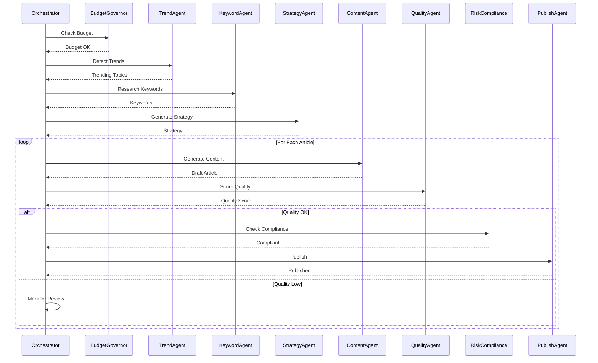
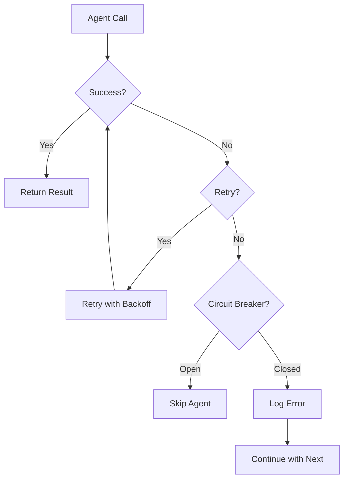

# Agent Coordination Model

## Overview

The InvestingPro platform uses a **centralized orchestrator pattern** with 17 specialized agents. The CMS Orchestrator coordinates all agents and makes high-level decisions.

---

## Architecture Pattern

### Centralized Orchestrator

```
┌─────────────────────────────────────┐
│      CMS Orchestrator                │
│  (Single Point of Coordination)     │
└──────────────┬──────────────────────┘
               │
    ┌──────────┴──────────┐
    │                     │
┌───▼────┐         ┌──────▼─────┐
│ Agents │         │  Services   │
│        │         │             │
│ 17     │         │ Database    │
│ Agents │         │ Cache       │
│        │         │ Queue       │
└────────┘         └─────────────┘
```

### Communication Model

**Current:** Synchronous Request-Response
- Orchestrator calls agents directly
- Agents return results synchronously
- Error handling via try-catch

**Future:** Event-Driven (Planned)
- Event bus for agent communication
- Async processing
- Better scalability

---

## Agent Categories

### 1. Discovery Agents

#### TrendAgent
- **Purpose**: Detects trending financial topics
- **Input**: News feeds, social media, search trends
- **Output**: List of trending topics with scores
- **Dependencies**: None

#### KeywordAgent
- **Purpose**: Researches target keywords
- **Input**: Topics, categories
- **Output**: Keyword list with priority scores
- **Dependencies**: TrendAgent (optional)

#### StrategyAgent
- **Purpose**: Generates content strategy
- **Input**: Trends, keywords, goals
- **Output**: Content strategy with article list
- **Dependencies**: TrendAgent, KeywordAgent

### 2. Generation Agents

#### ContentAgent
- **Purpose**: Generates article content
- **Input**: Topic, keywords, strategy
- **Output**: Draft article
- **Dependencies**: StrategyAgent, PromptManager

#### ImageAgent
- **Purpose**: Generates/selects images
- **Input**: Article content, topic
- **Output**: Image URLs
- **Dependencies**: ContentAgent

#### BulkGenerationAgent
- **Purpose**: Handles bulk operations
- **Input**: Bulk generation config
- **Output**: Multiple articles
- **Dependencies**: ContentAgent, ImageAgent

### 3. Quality Agents

#### QualityAgent
- **Purpose**: Scores content quality
- **Input**: Article content
- **Output**: Quality score (0-100)
- **Dependencies**: ContentAgent

#### RiskComplianceAgent
- **Purpose**: Ensures regulatory compliance
- **Input**: Article content
- **Output**: Compliance status
- **Dependencies**: ContentAgent

#### HealthMonitorAgent
- **Purpose**: Monitors system health
- **Input**: System metrics
- **Output**: Health status
- **Dependencies**: None

### 4. Distribution Agents

#### PublishAgent
- **Purpose**: Publishes articles
- **Input**: Approved article
- **Output**: Published article
- **Dependencies**: QualityAgent, RiskComplianceAgent

#### SocialAgent
- **Purpose**: Creates social media posts
- **Input**: Published article
- **Output**: Social posts
- **Dependencies**: PublishAgent

#### RepurposeAgent
- **Purpose**: Repurposes content
- **Input**: Published article
- **Output**: Repurposed content
- **Dependencies**: PublishAgent

### 5. Optimization Agents

#### TrackingAgent
- **Purpose**: Tracks performance
- **Input**: Published articles
- **Output**: Performance metrics
- **Dependencies**: PublishAgent

#### FeedbackLoopAgent
- **Purpose**: Provides optimization feedback
- **Input**: Performance metrics
- **Output**: Recommendations
- **Dependencies**: TrackingAgent

#### AffiliateAgent
- **Purpose**: Manages affiliate links
- **Input**: Article content
- **Output**: Affiliate placements
- **Dependencies**: ContentAgent

### 6. Infrastructure Agents

#### BudgetGovernorAgent
- **Purpose**: Manages costs
- **Input**: Generation requests
- **Output**: Budget status
- **Dependencies**: None

#### ScraperAgent
- **Purpose**: Scrapes external data
- **Input**: URLs, selectors
- **Output**: Scraped data
- **Dependencies**: None

#### EconomicIntelligenceAgent
- **Purpose**: Economic analysis
- **Input**: Economic data
- **Output**: Analysis results
- **Dependencies**: None

---

## Coordination Flow

### Standard Generation Cycle



### Error Handling



---

## Agent Interface

### Base Agent

All agents extend `BaseAgent`:

```typescript
abstract class BaseAgent {
    protected name: string;
    protected supabase: SupabaseClient;
    
    abstract execute(context: AgentContext): Promise<AgentResult>;
    
    protected handleError(error: Error, context: AgentContext): AgentResult;
}
```

### Agent Context

```typescript
interface AgentContext {
    action: string;
    articleId?: string;
    topic?: string;
    keywords?: string[];
    // ... other context
}
```

### Agent Result

```typescript
interface AgentResult {
    success: boolean;
    data?: any;
    error?: string;
    executionTime: number;
}
```

---

## Best Practices

### 1. Agent Design
- ✅ Single Responsibility: Each agent has one clear purpose
- ✅ Stateless: Agents don't maintain state between calls
- ✅ Idempotent: Same input produces same output
- ✅ Error Handling: Agents handle errors gracefully

### 2. Orchestration
- ✅ Sequential Dependencies: Respect agent dependencies
- ✅ Parallel Execution: Execute independent agents in parallel
- ✅ Error Recovery: Continue with next article on failure
- ✅ Budget Checks: Check budget before expensive operations

### 3. Performance
- ✅ Caching: Cache expensive operations
- ✅ Timeouts: Set timeouts for all operations
- ✅ Retries: Retry transient failures
- ✅ Circuit Breakers: Prevent cascading failures

---

**See Also:**
- [System Design Documentation](../SYSTEM_DESIGN.md)
- [State Machine Documentation](./state-machine.md)
- [API Contracts Documentation](../api/contracts.md)
