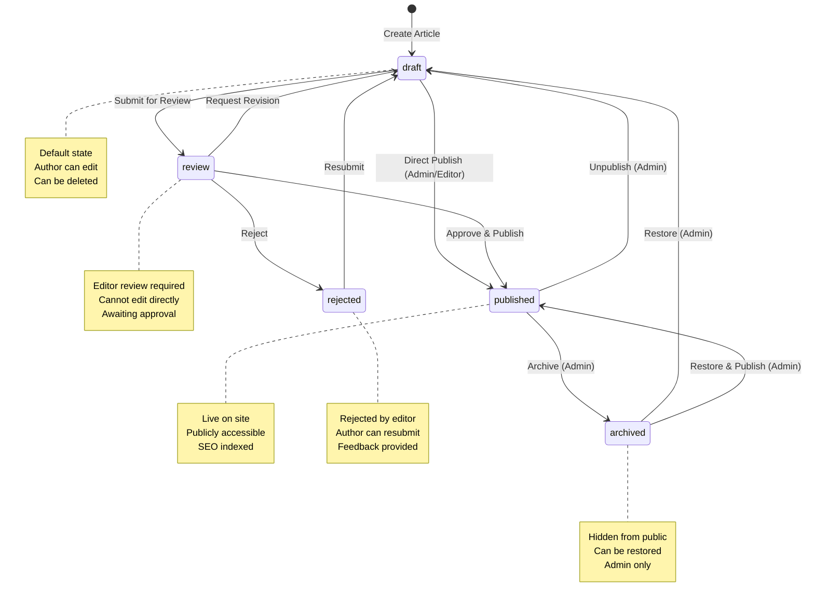

# State Machine Documentation

## Overview

The InvestingPro platform uses a **state machine** to manage article lifecycle. State transitions are enforced at both database and application levels.

---

## Article Status States

### State Diagram



---

## Valid Transitions

### Transition Matrix

| From State | To State | Allowed Roles | Notes |
|------------|----------|---------------|-------|
| draft | review | author, editor, admin | Submit for review |
| draft | published | editor, admin | Direct publish (bypass review) |
| review | draft | editor, admin | Request revision |
| review | published | editor, admin | Approve and publish |
| review | rejected | editor, admin | Reject with reason |
| rejected | draft | author, editor, admin | Resubmit after revision |
| rejected | review | editor, admin | Approve rejected article |
| published | archived | admin | Archive published article |
| published | draft | admin | Unpublish (make draft) |
| archived | draft | admin | Restore to draft |
| archived | published | admin | Restore and publish |

### Invalid Transitions

- ❌ `draft` → `rejected` (must go through review)
- ❌ `published` → `review` (already published)
- ❌ `archived` → `review` (must restore first)
- ❌ `rejected` → `published` (must go through draft/review)

---

## State Definitions

### draft
- **Description**: Initial state, article being created
- **Permissions**: Author can edit, delete
- **Visibility**: Not publicly visible
- **Actions**: Can submit for review or publish directly (if editor/admin)

### review
- **Description**: Awaiting editor approval
- **Permissions**: Editor/admin can approve/reject/request revision
- **Visibility**: Not publicly visible
- **Actions**: Cannot edit directly, must request revision

### published
- **Description**: Live on site, publicly accessible
- **Permissions**: Admin can archive/unpublish
- **Visibility**: Publicly visible, SEO indexed
- **Actions**: Cannot edit directly, must unpublish first

### rejected
- **Description**: Rejected by editor
- **Permissions**: Author can resubmit, editor can approve
- **Visibility**: Not publicly visible
- **Actions**: Can resubmit after revision

### archived
- **Description**: Hidden from public, preserved
- **Permissions**: Admin only
- **Visibility**: Not publicly visible
- **Actions**: Can restore to draft or publish

---

## Enforcement Mechanisms

### Database Level

#### 1. Validation Function
```sql
CREATE FUNCTION validate_article_status_transition(
    old_status TEXT,
    new_status TEXT,
    user_role TEXT
) RETURNS BOOLEAN
```

#### 2. Enforcement Trigger
```sql
CREATE TRIGGER enforce_article_status_transition_trigger
    BEFORE UPDATE ON articles
    FOR EACH ROW
    WHEN (OLD.status IS DISTINCT FROM NEW.status)
    EXECUTE FUNCTION enforce_article_status_transition();
```

#### 3. Status History
All transitions are logged in `article_status_history` table:
- `old_status`
- `new_status`
- `changed_by`
- `change_reason`
- `created_at`

### Application Level

#### 1. Workflow Engine
- Validates transitions before execution
- Enforces role-based permissions
- Logs transitions

#### 2. API Endpoints
- Check permissions before status updates
- Validate transitions
- Return clear error messages

---

## State Transition Examples

### Example 1: Standard Publishing Flow

```
1. Author creates article → draft
2. Author submits → review
3. Editor approves → published
```

### Example 2: Revision Flow

```
1. Author creates article → draft
2. Author submits → review
3. Editor requests revision → draft
4. Author revises → review
5. Editor approves → published
```

### Example 3: Rejection Flow

```
1. Author creates article → draft
2. Author submits → review
3. Editor rejects → rejected
4. Author revises → draft
5. Author resubmits → review
```

### Example 4: Direct Publish (Editor)

```
1. Editor creates article → draft
2. Editor publishes directly → published
```

### Example 5: Archive Flow

```
1. Article is published → published
2. Admin archives → archived
3. Admin restores → published
```

---

## Role-Based Permissions

### Author Role
- ✅ Create articles (draft)
- ✅ Edit own drafts
- ✅ Submit for review (draft → review)
- ✅ Resubmit rejected articles (rejected → draft)
- ❌ Cannot publish directly
- ❌ Cannot approve/reject

### Editor Role
- ✅ All author permissions
- ✅ Approve articles (review → published)
- ✅ Reject articles (review → rejected)
- ✅ Request revision (review → draft)
- ✅ Publish directly (draft → published)
- ❌ Cannot archive

### Admin Role
- ✅ All editor permissions
- ✅ Archive articles (published → archived)
- ✅ Unpublish articles (published → draft)
- ✅ Restore archived articles (archived → draft/published)
- ✅ All state transitions

---

## Error Handling

### Invalid Transition Attempt

**Database Level:**
```sql
ERROR: Invalid status transition from 'published' to 'review' for role 'editor'
```

**Application Level:**
```typescript
{
    success: false,
    error: {
        code: 'INVALID_TRANSITION',
        message: 'Cannot transition from published to review',
        allowedTransitions: ['archived', 'draft']
    }
}
```

### Missing Permissions

```typescript
{
    success: false,
    error: {
        code: 'FORBIDDEN',
        message: 'Insufficient permissions for this transition',
        requiredRole: 'admin',
        currentRole: 'editor'
    }
}
```

---

## Best Practices

### 1. State Management
- ✅ Always use workflow engine for transitions
- ✅ Never bypass state machine
- ✅ Log all transitions
- ✅ Validate permissions before transitions

### 2. Error Handling
- ✅ Provide clear error messages
- ✅ Suggest valid transitions
- ✅ Log invalid attempts
- ✅ Return appropriate HTTP status codes

### 3. Testing
- ✅ Test all valid transitions
- ✅ Test invalid transitions
- ✅ Test role-based permissions
- ✅ Test database enforcement

---

## Migration Notes

The state machine enforcement was added in migration `20260116_state_machine_enforcement.sql`.

**Before Migration:**
- Status transitions not enforced
- Articles could bypass states
- No transition history

**After Migration:**
- All transitions validated
- Transition history tracked
- Role-based enforcement

---

**See Also:**
- [System Design Documentation](../SYSTEM_DESIGN.md)
- [Agent Coordination Documentation](./agent-coordination.md)
- [API Contracts Documentation](../api/contracts.md)
